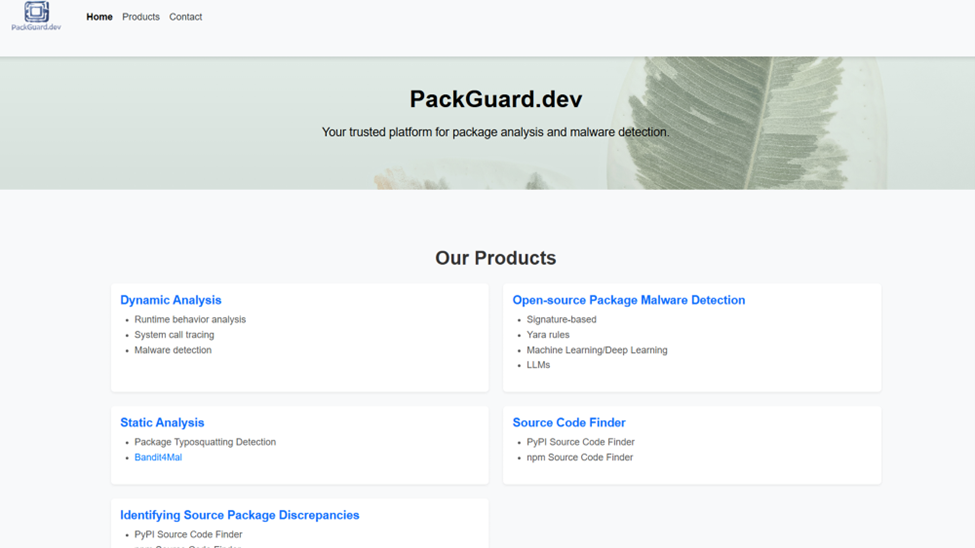
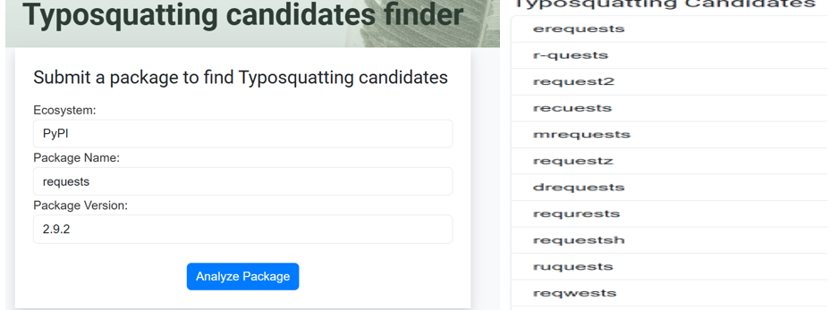
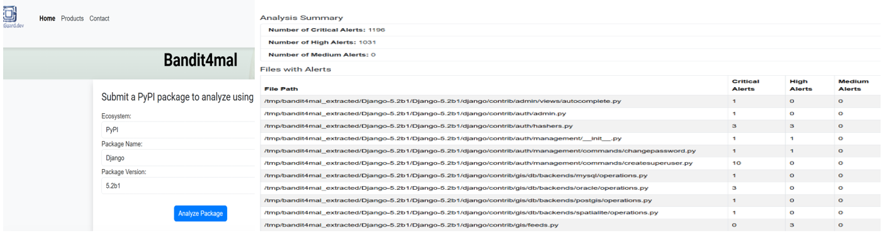
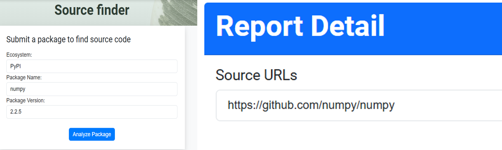
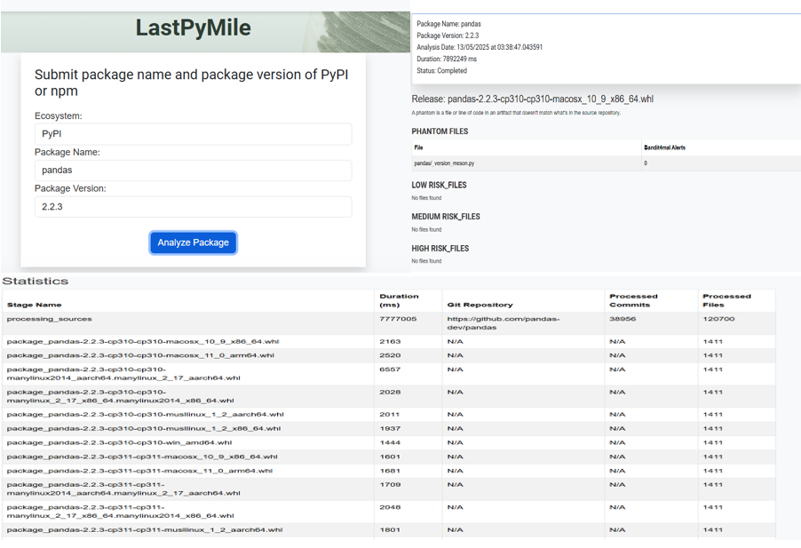
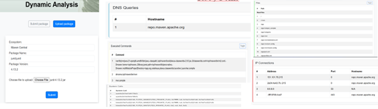

# Pack-A-Mal

The Pack-A-Mal project analyzes the capabilities of packages available on open source repositories. The project identifies behaviors that indicate malicious software by examining:

- What files do packages access?
- What addresses do they connect to?
- What commands do they execute?
- What system calls do they use?

## How it works

The project consists of the following components:

### Web Dashboard

A comprehensive web interface for viewing analysis results and managing package scans.

A screenshot of the Pack-A-Mal web dashboard, showing the main interface for managing and viewing package analysis results.

[Video demo: Pack-A-Mal features](https://youtu.be/I9vxdmKnqL4)

### Static Analysis

#### Typosquatting Candidates Finder

This image displays a list of typosquatting candidates for the Requests package on PyPI, as identified by the OSSGadget tool.

- Finds typosquatting candidates from package names using the OSSGadget tool
- Supported package repositories: PyPI, npm, RubyGems, Crates.io, Packagist, Maven

#### Bandit4mal

This screenshot shows files flagged as potentially malicious by the Bandit4mal tool for the Django package on PyPI.

- A static analysis tool that identifies malicious code in source code or PyPI package releases
- Supported package repositories: PyPI

#### Source Code Repository Finder

This image highlights the source code repository URL for the NumPy package on PyPI, as found by the Py2Src tool.

#### Finding Discrepancies Between Source and Package

This figure illustrates discrepancies detected between the source code repository and the release package for the Pandas package (PyPI), as identified by the Lastpymile tool.

- Uses the Lastpymile tool to find discrepancies between release artifacts and source code repositories on GitHub
- Supported package repositories: PyPI, npm

### Dynamic Analysis

This screenshot presents the results of dynamic analysis for the junit package (Maven), including executed commands, network connections, file accesses, and system calls.

- Uses the package-analysis tool from OpenSSF with extended capabilities for Maven Central and Wolfi APKs
- Supported package repositories: npm, PyPI, Maven, RubyGems, Wolfi, Crates.io, Packagist

#### Yara Module

Advanced pattern matching for malware detection using custom Yara rules.

[Yara Module Documentation](./web/package-analysis-web/package_analysis/src/yara/rules/README.md)

## Case Study: @solana-web3.js Supply Chain Attack

A supply chain attack was detected in versions 1.95.6 and 1.95.7 of the popular `@solana/web3.js` library, which receives over 350,000 weekly downloads on npm. These compromised versions contained injected malicious code designed to steal private keys from unsuspecting developers and users, potentially enabling attackers to drain cryptocurrency wallets.

The malicious code also included dropper malware hosted on GitHub.com to steal sensitive system files (e.g., `/etc/passwd`, SSH keys, etc.).

[Video demo: Case study analysis of solana-web3.js APK](https://youtu.be/uZQzMZ8dSdI)

## Required Dependencies

- Go v1.23.1
- Docker
- [OSS-detect-backdoor](https://github.com/microsoft/OSSGadget/releases/tag/v0.1.422)
- [Bandit4mal](https://github.com/lyvd/bandit4mal)
- [Py2src](https://github.com/simonepirocca/py2src)
- [Lastpymile](https://github.com/assuremoss/lastpymile)

